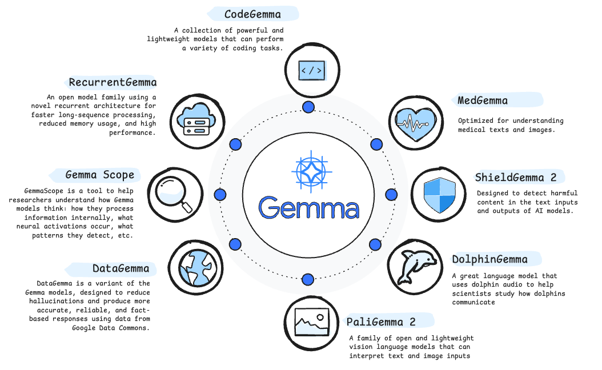
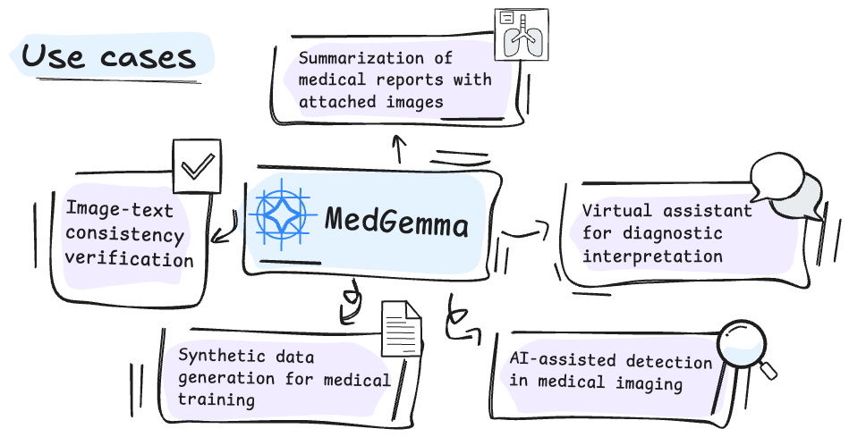

---

# 🔄 **License Notice**

This notebook is based on the official [Google tutorial](https://colab.research.google.com/github/google-health/medgemma/blob/main/notebooks/quick_start_with_hugging_face.ipynb) **"quick_start_with_hugging_face"**, released under the [Apache 2.0 License](https://www.apache.org/licenses/LICENSE-2.0).

`Copyright 2025 Google LLC.`
`Licensed under the Apache License, Version 2.0.`

 

----
 

# 💎 What is Gemma?
Gemma is a family of open language models developed by Google DeepMind and other Google teams. Built on the same underlying technology as the Gemini models, Gemma models offer free access to their weights. While categorized as "open models," their terms of use, redistribution rights, and ownership vary by version and may not conform to standard open-source licenses.

The Gemma family includes variants tailored to different use cases, such as code generation, multimodal processing (text and images), structured data reasoning, and content classification. MedGemma is a specialized variant optimized for medical applications, with the ability to interpret clinical text and medical images such as mammograms. Other models, such as ShieldGemma 2, focus on detecting harmful content, while DataGemma integrates real-world statistical data through retrieval techniques to improve factual accuracy and reduce hallucinations in model outputs.

 

----

 

# ❤️ MedGemma

**MedGemma** is a collection of **Gemma 3** variants that are trained for performance on medical text and image comprehension. Developers can use MedGemma to accelerate building healthcare-based AI applications. MedGemma comes in two variants: a 4B multimodal version and a 27B text-only version.

 

----

 

## ❤️ MedGemma: Use cases

This open-source model enables a wide range of potential applications that can be explored and developed. Below is a list of possible use cases where MedGemma can be applied:

1. **AI-assisted detection in medical imaging**
Support for early identification of clinical findings in mammograms, X-rays, CT scans, or ultrasounds through visual pattern analysis.

2. **Summarization of medical reports with attached images**
Ability to generate automatic summaries from clinical reports that include image references, improving efficiency in medical documentation.

3. **Virtual assistant for diagnostic interpretation**
Real-time support for healthcare professionals in interpreting findings from medical images and linking them to patient history or reported symptoms.

4. **Synthetic data generation for medical training**
Generation of simulated clinical text from image inputs, useful for medical education or testing diagnostic tools.

5. **Image-text consistency verification**
Automatic validation of whether the written report accurately reflects the visual content of the associated medical image.

 

---
 

## 🩻 Tutorial
Below you can see an example of the kind of output you can generate by running this model.

This tutorial is based on the official notebook provided by Google Health, which you can find here: 🔗 [Colab – MedGemma Quick Start with Hugging Face](https://colab.research.google.com/github/google-health/medgemma/blob/main/notebooks/quick_start_with_hugging_face.ipynb)

The following image was taken from a public dataset on Kaggle:  **Bone Fracture Detection: Computer Vision Project**🔗 [View dataset](https://www.kaggle.com/datasets/pkdarabi/bone-fracture-detection-computer-vision-project/data)

🩻 **Image used**`fracture-of-the-humeral-capitellum-milch-type-1-1-1-_jpg.rf.8b022b79c884d0b37d923a3c961591c6.jpg`

